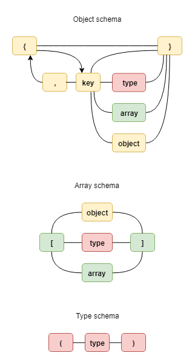

## Feature
- Support for type define
- Support for object define
- Support for array define

# Usage



## **1. Type Define**
Used to check type of a input data. To define type of a target input used :

Syntax : 
```js
(type) // for single type
(type1|type2|...) // for multi type
```

Example :
```js
(string) // check input if match a string
(number|Object|Buffer) // check input if it match number, Object or Buffer type
```

Type validator used Hyron [type-filter](https://github.com/hyron-group/hyron/blob/master/lib/typeFilter.js) engine. So, it supported for any of type include primitive type (``string``, ``boolean``, ``number``, ``object``, ``undefined``), default object type (``Array``, ``Promise``, ``Buffer``, ``AsyncFunction``, ``Error``), and custom object type

## **2. Object Define**
Used to check on each of key-value from object input. To define for a object input used :

Syntax :

```js
{
    key1, // check if key1 is not undefined
    key2(type), // check if value of key2 is string
    key3[array], // check if value of key3 is a array of string
    key4 {object} // check if key4 is a nested object
}
```

Example :
```js
{
    key1, // check if key1 is not undefined
    key2(string), // check if value of key2 is string
    key3[string], // check if value of key3 is a array of string
    key4 { // check if key4 is a nested object
        child1 {} // check if key4.child1 is a nested object
    }
}
```

Object validator inherited from type define and array define. So, you can used it inside to define field struct. It also support for nested object

## **3. Array Define**
Used to check type of each element of array. To define for a array input, used :

```js
[type] // for single type
[type1|type2|...] // for multi type
[[array]] // for nested array
[{object}] // for object type
```

Example
```js
[string] // for single type
[string|number|...] // for multi type
[[boolean]] // for check type inside
[{key1,key2}] // for check array of object
```

Array define used same engine with Type define. So, you can used it for check type of every element in array. It also support for object data type, and nest array type 